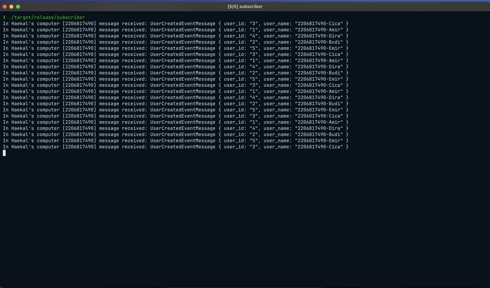
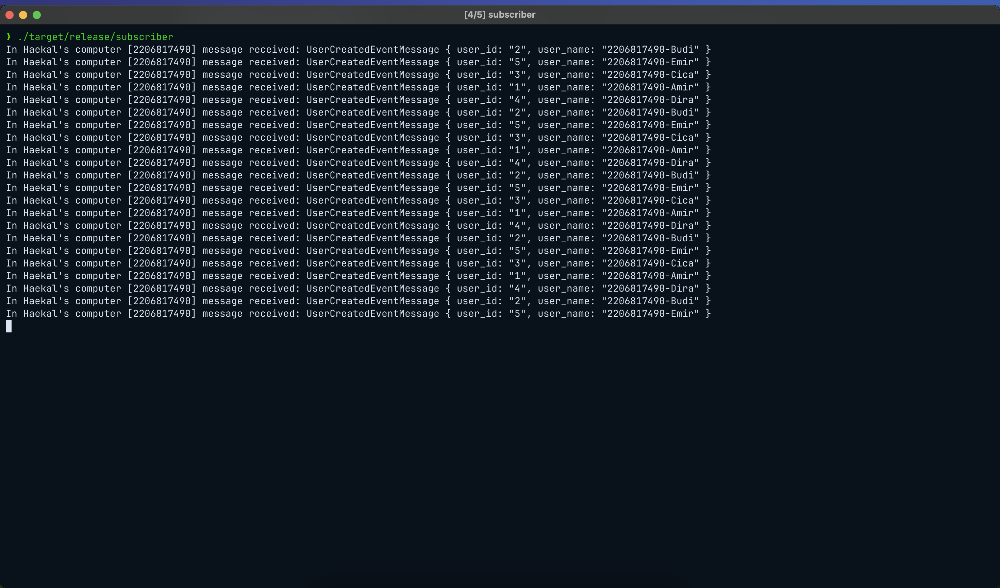
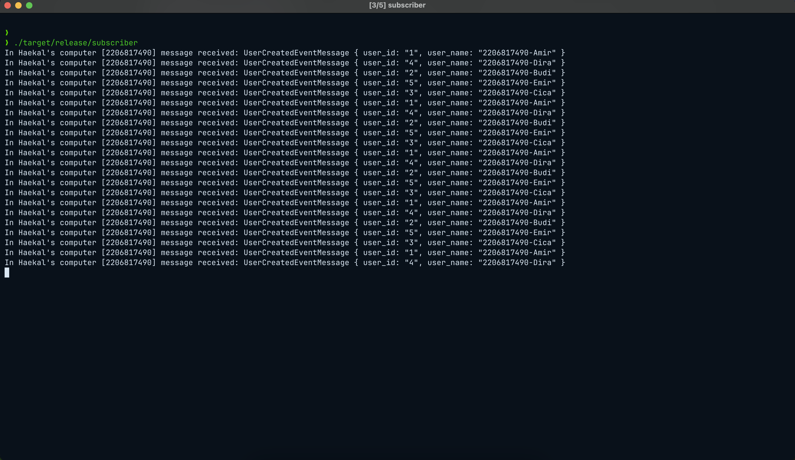
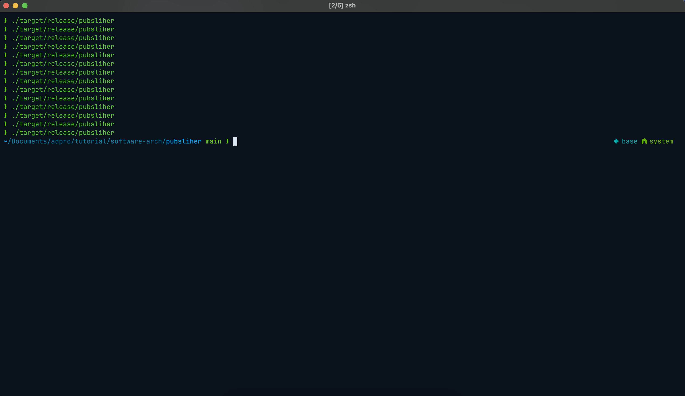
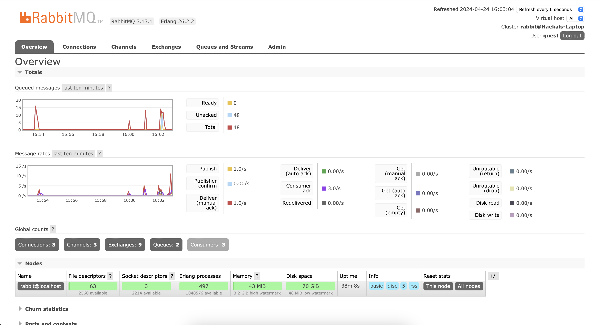

## Muhammad Haekal Kalipaksi

## 2206817490

### Reflections

**What is amqp?**
AMQP is Advance Message Queue Protocol is a open standard protocol for messages passing and queue between different application or services. In this tutorial we use RabbtitMq messages broker which implement AMQP.

Amqp is

**what it means? guest:guest@localhost:5672 , what is the first guest, and what is the second guest, and what is localhost:5672 is for?**

First guest is username, second guest is password and, the localhost:5672 is where the queue server located. Im using .env to store the amqp url.

**Simulation slow subscriber**


In my case the queue is below 20 but above 15, so its around that, because of the delay from thread 10 millis second, subscriber will receive the messages slower and rabbitmq must keep the messages send by publisher into the queue and send the messages to subscriber until the queue is empty. In images above the messages seding in rate is 3.0/second and 1.0/second

**Reflection and running at least three subscribers**

**Subcriber 1**



**Subcriber 2**



**Subcriber 3**



**Publisher**



**Monitoring**



Based on the images above im running a three subscriber service with the same queue and event name which running subsriber with three concurrent process and. With concurrent process the messages broker will split the messages sending from queue that's why every publisher send a messages to message broker each subscriber will have different received messages from queue.

From the code of publisher and subscriber i already improve the code

- Use latest package of crosstown_bus which i have to change the method that i use in both subcriber and publisher

Subscriber

```rs
_ = listener.subscribe(
    String::from("user_created"),
    UserCreatedHandler {},
    QueueProperties {
        auto_delete: false,
        durable: false,
        use_dead_letter: true,
        consume_queue_name: Some("user".to_string()),
    },
);
```

Publisher

```rs
_ = publisher.send(String::from("user_created"), message)
```

- Clean the code

Use loop, vector in publisher, create the messages first to make it look cleaner

```rs
let users: Vec<&str> = vec!["Amir", "Budi", "Cica", "Dira", "Emir"];

for (i, user) in users.iter().enumerate() {
    let user_id = (i + 1).to_string();
    let user_name = format!("2206817490-{}", user);
    let message: UserCreatedEventMesage = UserCreatedEventMesage { user_id, user_name };
    _ = publisher.send(String::from("user_created"), message)
}
```

- use dotenv to make rabbitmq secret

```rs
dotenv().ok();
let rabbitmq_url = env::var("RABBITMQ_URL").unwrap();
```
